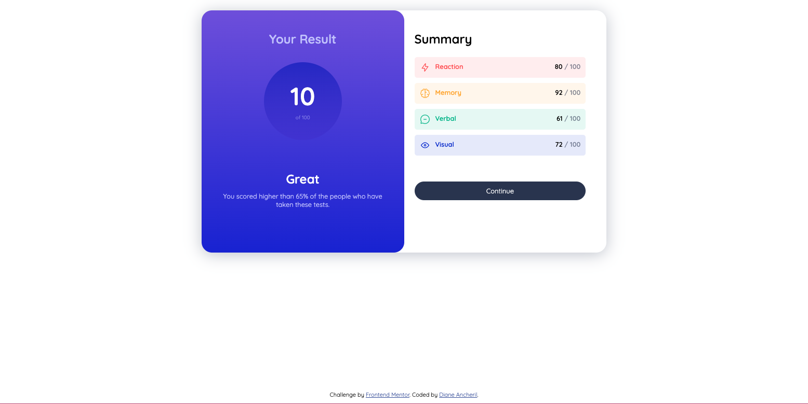
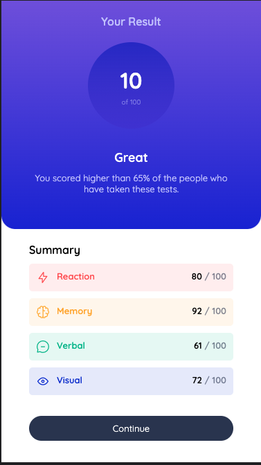

# Frontend Mentor - Results summary component solution

This is a solution to the [Results summary component challenge on Frontend Mentor](https://www.frontendmentor.io/challenges/results-summary-component-CE_K6s0maV). Frontend Mentor challenges help you improve your coding skills by building realistic projects.

## Table of contents

  - [The challenge](#the-challenge)
  - [Screenshot](#screenshot)
  - [Links](#links)
  - [Built with](#built-with)

### The challenge

Users should be able to:

- View the optimal layout for the interface depending on their device's screen size
- See hover and focus states for all interactive elements on the page

### Screenshot

### Links

- Solution URL: [https://github.com/dianesancheril/results-summary-component-main]
- Live Site URL: [https://dianesancheril.github.io/results-summary-component-main/]

## My process

I started by recreating the design for a mobile device and then used media queries to modify the styling for devices with a width greater than 393px and devices with a width greater than 900px.

### Built with

- Semantic HTML5 markup
- CSS custom properties
